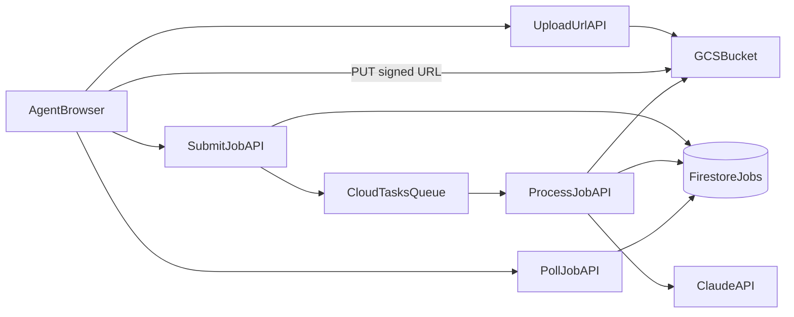

# Phase 2 Implementation Plan (No Cloud Run)

## Scope and Guardrails

- Keep the working `ai-pdf` extraction path untouched while building v3.
- Do not reintroduce local PDF parsing libraries (`pdfjs-dist`, `pdf-parse`, canvas deps).
- Build a new `ingestion/v3` path in parallel, cut traffic only after tests pass.
- Single upload lane at end-state: GCS signed URL only.

## Architecture (Revised)

## Step-by-Step Plan

### Step 1: Introduce v3 contracts (strict, typed, evidence-ready)

- **Create**:
  - `[/Users/danielroberts/Desktop/insurance-app/web/lib/ingestion-v3-types.ts](/Users/danielroberts/Desktop/insurance-app/web/lib/ingestion-v3-types.ts)`
  - `[/Users/danielroberts/Desktop/insurance-app/web/lib/ingestion-v3-errors.ts](/Users/danielroberts/Desktop/insurance-app/web/lib/ingestion-v3-errors.ts)`
- **Modify**:
  - `[/Users/danielroberts/Desktop/insurance-app/web/lib/types.ts](/Users/danielroberts/Desktop/insurance-app/web/lib/types.ts)` (add v3 response types, keep v2 compatibility)
- Define:
  - v3 statuses: `queued`, `uploading`, `processing`, `review_ready`, `saved`, `failed`.
  - typed errors: `UPLOAD_NOT_FOUND`, `CLAUDE_TIMEOUT`, `CLAUDE_SCHEMA_INVALID`, `VALIDATION_FAILED`, `MAX_RETRIES_EXHAUSTED`, etc.
  - extraction evidence shape per field: page + snippet + confidence.

**Estimate:** 0.5 day

### Step 2: Build single upload lane endpoint (v3)

- **Create**:
  - `[/Users/danielroberts/Desktop/insurance-app/web/app/api/ingestion/v3/upload-url/route.ts](/Users/danielroberts/Desktop/insurance-app/web/app/api/ingestion/v3/upload-url/route.ts)`
- **Reuse logic from**:
  - `[/Users/danielroberts/Desktop/insurance-app/web/app/api/storage/upload-url/route.ts](/Users/danielroberts/Desktop/insurance-app/web/app/api/storage/upload-url/route.ts)`
- Keep only signed GCS URL issuance for v3 (`purpose: application | bob`).

**Estimate:** 0.5 day

### Step 3: Add v3 job submit + poll APIs (Firestore as system of record)

- **Create**:
  - `[/Users/danielroberts/Desktop/insurance-app/web/app/api/ingestion/v3/jobs/route.ts](/Users/danielroberts/Desktop/insurance-app/web/app/api/ingestion/v3/jobs/route.ts)`
  - `[/Users/danielroberts/Desktop/insurance-app/web/app/api/ingestion/v3/jobs/[jobId]/route.ts](/Users/danielroberts/Desktop/insurance-app/web/app/api/ingestion/v3/jobs/[jobId]/route.ts)`
  - `[/Users/danielroberts/Desktop/insurance-app/web/lib/ingestion-v3-store.ts](/Users/danielroberts/Desktop/insurance-app/web/lib/ingestion-v3-store.ts)`
- Submit endpoint responsibilities:
  - validate `gcsPath` exists in payload.
  - create Firestore job doc.
  - enqueue Cloud Task with `jobId`.
- Poll endpoint responsibilities:
  - return typed job state + typed errors + evidence payload.

**Estimate:** 1 day

### Step 4: Integrate Cloud Tasks dispatch (no Cloud Run)

- **Create**:
  - `[/Users/danielroberts/Desktop/insurance-app/web/lib/cloud-tasks.ts](/Users/danielroberts/Desktop/insurance-app/web/lib/cloud-tasks.ts)`
- **Modify**:
  - `[/Users/danielroberts/Desktop/insurance-app/web/lib/firebase-admin.ts](/Users/danielroberts/Desktop/insurance-app/web/lib/firebase-admin.ts)` only if shared env helper extraction is needed.
  - `[/Users/danielroberts/Desktop/insurance-app/web/package.json](/Users/danielroberts/Desktop/insurance-app/web/package.json)` to add `@google-cloud/tasks`.
- Add env contract (documented): queue path, service account email, audience URL, region, project id.

**Estimate:** 0.5 day

### Step 5: Build v3 processor endpoint on Vercel (task target)

- **Create**:
  - `[/Users/danielroberts/Desktop/insurance-app/web/app/api/ingestion/v3/jobs/[jobId]/process/route.ts](/Users/danielroberts/Desktop/insurance-app/web/app/api/ingestion/v3/jobs/[jobId]/process/route.ts)`
  - `[/Users/danielroberts/Desktop/insurance-app/web/lib/ingestion-v3-processor.ts](/Users/danielroberts/Desktop/insurance-app/web/lib/ingestion-v3-processor.ts)`
- Processor flow:
  - verify task auth header / OIDC claims.
  - lock job (idempotent processing token).
  - fetch file from GCS by `gcsPath`.
  - branch by mime/file extension:
    - PDF -> Claude native document extraction.
    - CSV/XLSX -> existing parser path (or normalized parse module).
  - validate output schema.
  - write `review_ready` + evidence or `failed` with typed code.

**Estimate:** 1 day

### Step 6: Stage model and extraction modules (strict contracts, no parser branching)

- **Create**:
  - `[/Users/danielroberts/Desktop/insurance-app/web/lib/ingestion-v3-pdf.ts](/Users/danielroberts/Desktop/insurance-app/web/lib/ingestion-v3-pdf.ts)`
  - `[/Users/danielroberts/Desktop/insurance-app/web/lib/ingestion-v3-csv.ts](/Users/danielroberts/Desktop/insurance-app/web/lib/ingestion-v3-csv.ts)`
  - `[/Users/danielroberts/Desktop/insurance-app/web/lib/ingestion-v3-validate.ts](/Users/danielroberts/Desktop/insurance-app/web/lib/ingestion-v3-validate.ts)`
- **Modify (minimal and safe reuse)**:
  - `[/Users/danielroberts/Desktop/insurance-app/web/lib/application-extractor.ts](/Users/danielroberts/Desktop/insurance-app/web/lib/application-extractor.ts)` to expose a v3-safe helper that returns evidence metadata (page/snippet/confidence) without changing current v2 behavior.
- Ensure all missing/uncertain fields resolve to `null` (never guessed values).

**Estimate:** 1 day

### Step 7: Retries, backoff, and dead-letter semantics via Cloud Tasks + Firestore state

- **Modify**:
  - `[/Users/danielroberts/Desktop/insurance-app/web/lib/ingestion-v3-processor.ts](/Users/danielroberts/Desktop/insurance-app/web/lib/ingestion-v3-processor.ts)`
  - `[/Users/danielroberts/Desktop/insurance-app/web/lib/ingestion-v3-store.ts](/Users/danielroberts/Desktop/insurance-app/web/lib/ingestion-v3-store.ts)`
- Implement:
  - attempt count tracking in doc.
  - retry schedule aligned to spec (5s, 20s, 60s).
  - terminal failure when max attempts exceeded.
  - clear, typed, user-safe error message mapping.

**Estimate:** 0.5 day

### Step 8: UI cutover for single PDF (feature-flagged)

- **Modify**:
  - `[/Users/danielroberts/Desktop/insurance-app/web/components/ApplicationUpload.tsx](/Users/danielroberts/Desktop/insurance-app/web/components/ApplicationUpload.tsx)`
- Replace v2/Blob/direct branches with v3 flow:
  - request v3 signed URL
  - PUT to GCS
  - submit v3 job
  - poll v3 status
- Keep existing review/save UI behavior unchanged.

**Estimate:** 0.5 day

### Step 9: UI cutover for bulk local uploads (PDF + CSV/XLSX)

- **Modify**:
  - `[/Users/danielroberts/Desktop/insurance-app/web/app/dashboard/clients/page.tsx](/Users/danielroberts/Desktop/insurance-app/web/app/dashboard/clients/page.tsx)`
- Route each file to v3 submit flow with per-file `jobId` and status rendering.
- Preserve current review table + `import-batch` save semantics initially, then finalize after validation.

**Estimate:** 1 day

### Step 10: Remove deprecated transports/branches after successful cutover

- **Delete** (post-cutover only):
  - `[/Users/danielroberts/Desktop/insurance-app/web/app/api/upload/route.ts](/Users/danielroberts/Desktop/insurance-app/web/app/api/upload/route.ts)`
- **Modify / simplify**:
  - `[/Users/danielroberts/Desktop/insurance-app/web/app/api/parse-application/route.ts](/Users/danielroberts/Desktop/insurance-app/web/app/api/parse-application/route.ts)` (keep as compatibility shim or retire)
  - `[/Users/danielroberts/Desktop/insurance-app/web/app/api/parse-bob/route.ts](/Users/danielroberts/Desktop/insurance-app/web/app/api/parse-bob/route.ts)` (same)
  - `[/Users/danielroberts/Desktop/insurance-app/web/lib/ingestion-v2.ts](/Users/danielroberts/Desktop/insurance-app/web/lib/ingestion-v2.ts)` (deprecate to no-op/compat once v3 stable)
- Remove all Blob imports/usages from UI and APIs.

**Estimate:** 0.5 day

### Step 11: Deploy-gating corpus tests (block deploy on failures)

- **Create**:
  - `[/Users/danielroberts/Desktop/insurance-app/web/tests/ingestion-corpus/fixtures/README.md](/Users/danielroberts/Desktop/insurance-app/web/tests/ingestion-corpus/fixtures/README.md)`
  - `[/Users/danielroberts/Desktop/insurance-app/web/tests/ingestion-corpus/run-corpus.ts](/Users/danielroberts/Desktop/insurance-app/web/tests/ingestion-corpus/run-corpus.ts)`
  - `[/Users/danielroberts/Desktop/insurance-app/web/tests/ingestion-corpus/expectations.json](/Users/danielroberts/Desktop/insurance-app/web/tests/ingestion-corpus/expectations.json)`
- **Modify**:
  - `[/Users/danielroberts/Desktop/insurance-app/web/package.json](/Users/danielroberts/Desktop/insurance-app/web/package.json)` (add `test:ingestion-corpus` script)
  - CI/deploy pipeline entrypoint used by team (documented in repo, likely root deploy workflow/scripts).
- Corpus includes: tiny, large, multi-page, scanned/image, malformed.

**Estimate:** 0.5–1 day

### Step 12: Observability + docs + rollout

- **Create**:
  - `[/Users/danielroberts/Desktop/insurance-app/web/lib/ingestion-v3-telemetry.ts](/Users/danielroberts/Desktop/insurance-app/web/lib/ingestion-v3-telemetry.ts)`
- **Modify**:
  - `[/Users/danielroberts/Desktop/insurance-app/CONTEXT.md](/Users/danielroberts/Desktop/insurance-app/CONTEXT.md)`
  - `[/Users/danielroberts/Desktop/insurance-app/web/README.md](/Users/danielroberts/Desktop/insurance-app/web/README.md)`
- Add dashboards/log fields for stage durations, attempt counts, typed failures.
- Rollout sequence: internal -> 20% -> 100%, then remove v2.

**Estimate:** 0.5 day

## Order of Operations and Duration

- Day 1: Steps 1–3
- Day 2: Steps 4–6
- Day 3: Steps 7–9
- Day 4: Steps 10–12 and full cutover
- Total: ~5–7 working days (matches your target)

## Risk Controls

- Feature flag for v3 routing in UI until corpus + production smoke checks pass.
- Keep Phase 1 `ai-pdf` route intact during build; no modifications that destabilize current working path.
- Use idempotency keys per file hash + agent id to prevent duplicate jobs on retries.
- Mandatory human review before save remains unchanged.

## Acceptance Criteria

- No Blob/base64/FormData branches in end-state upload path.
- Every file enters via GCS signed URL + v3 job.
- Backend-driven retries (Cloud Tasks), not browser-driven processing.
- Typed job status and error codes visible in UI.
- Corpus gate blocks deploy on any regression.
- Production onboarding wave can process 2,000–4,000 PDFs with stable per-file state visibility.

